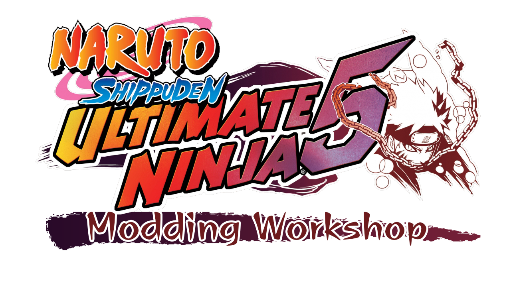

# About
Ultimate Ninja 5: Modding Workshop is a tool designed to be a primary tool that allows you to edit the game *Naruto Shippuden: Ultimate Ninja 5* at the code level and in real-time, thus facilitating the development of new mods for the game.

TODO:
✅ Free Battle: Allow Editing General Character Attributes
✅ Free Battle: Allow Editing Character Moveset Attributes
✅ Free Battle: Allow Editing Character Awakening Attributes
⏳ Free Battle: Allow Editing Character Jutsu Attributes
⬜ Free Battle: Allow Adding New Characters
⬜ Free Battle: Allow Adding New Moveset Combos
⬜ Free Battle: Allow Adding New Awakenings
⬜ Free Battle: Allow Adding New Jutsus
